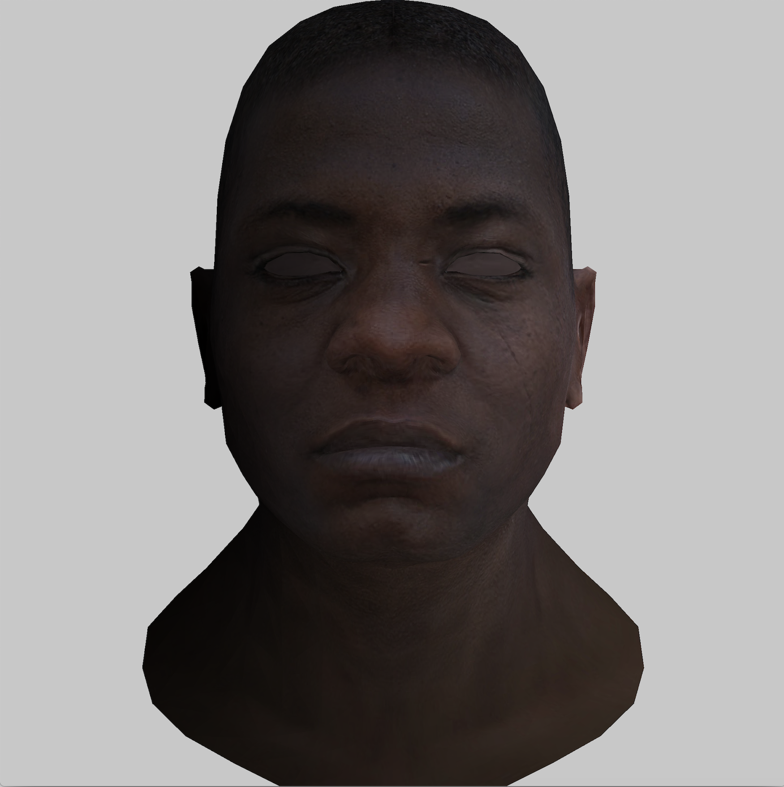
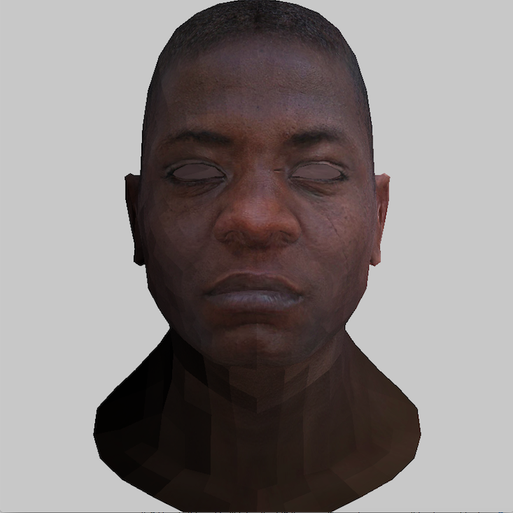
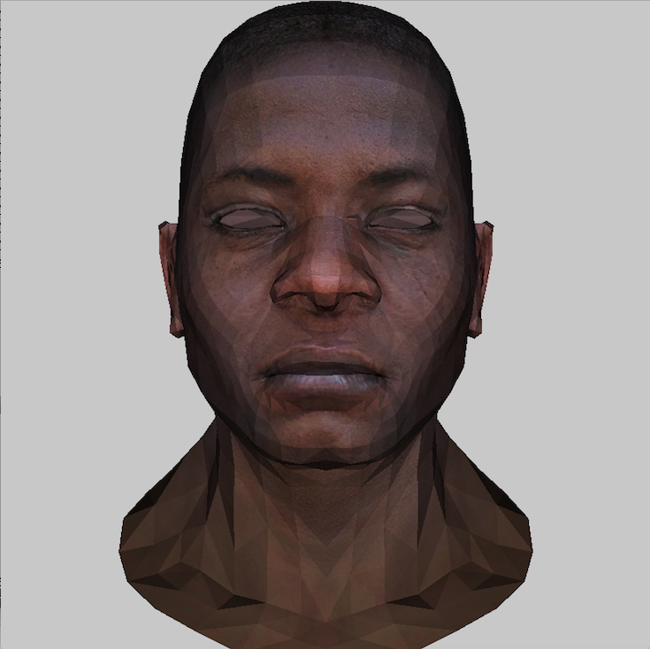
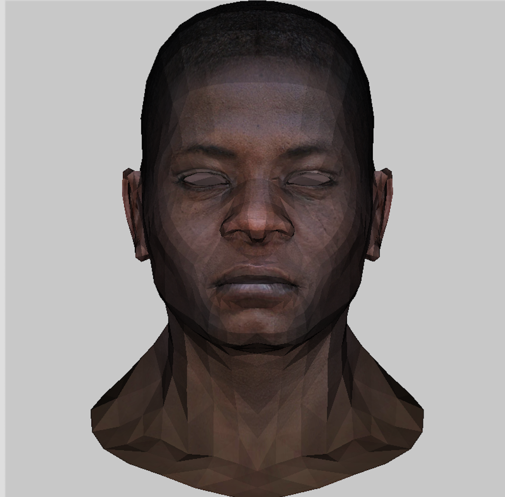
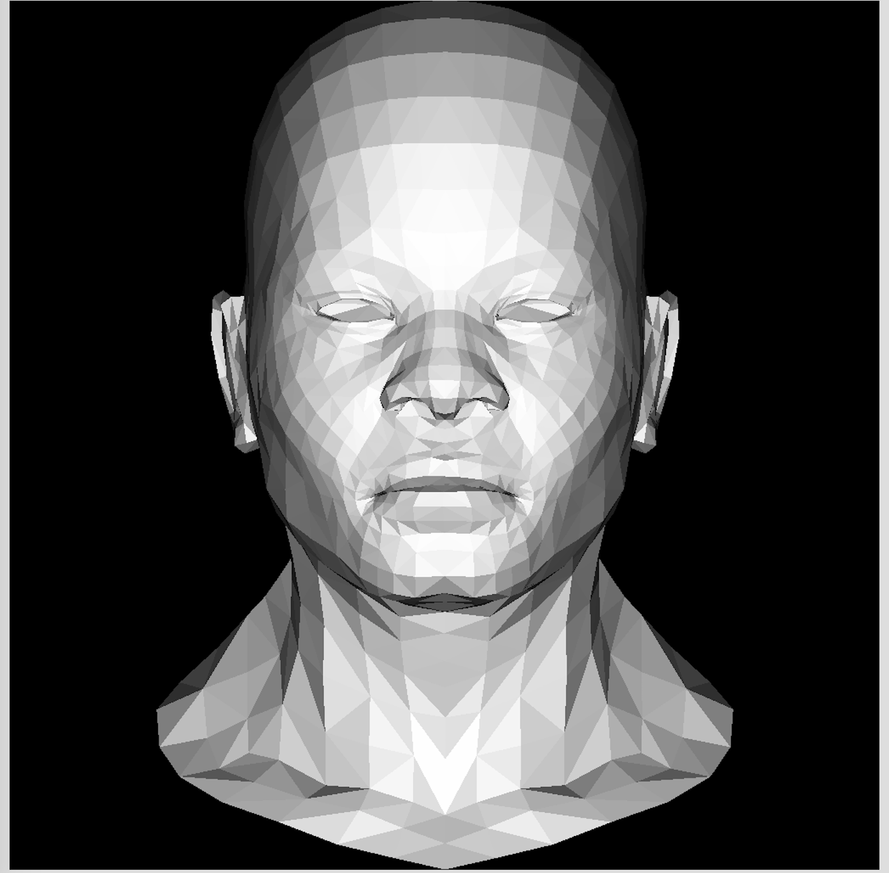
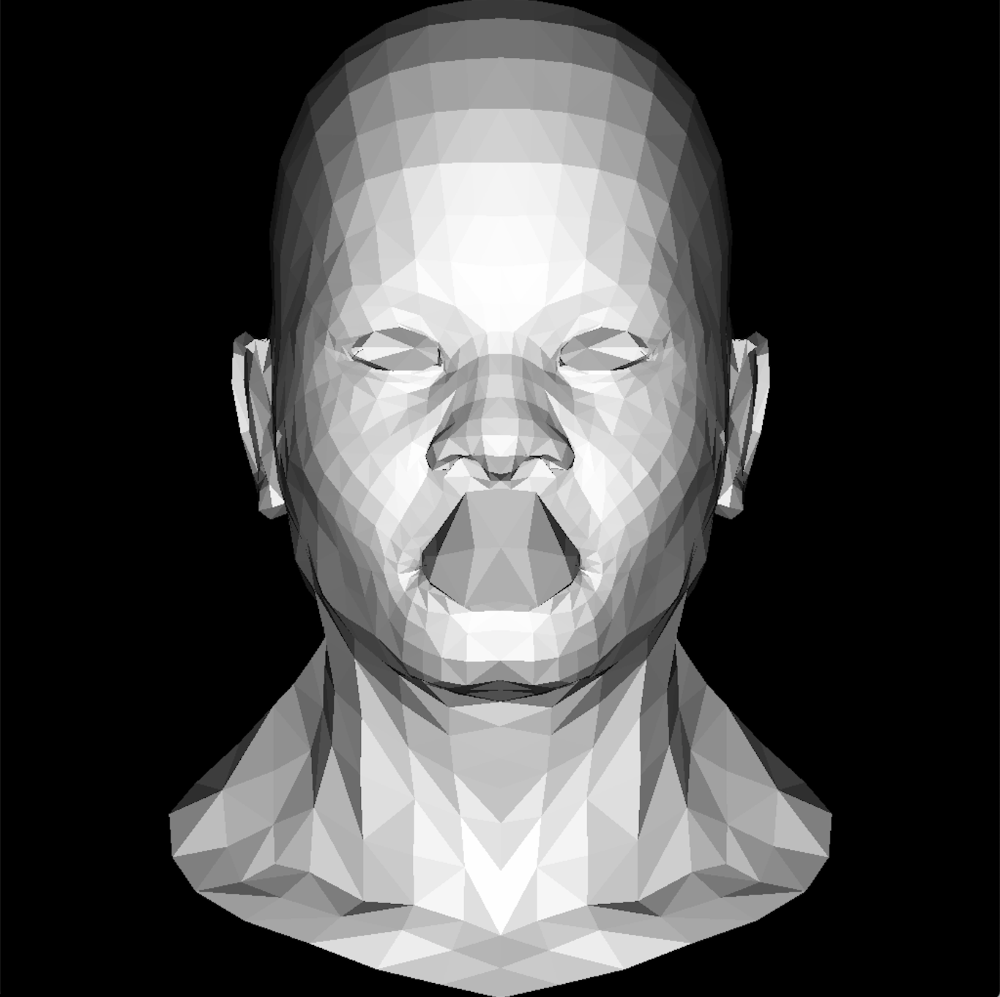
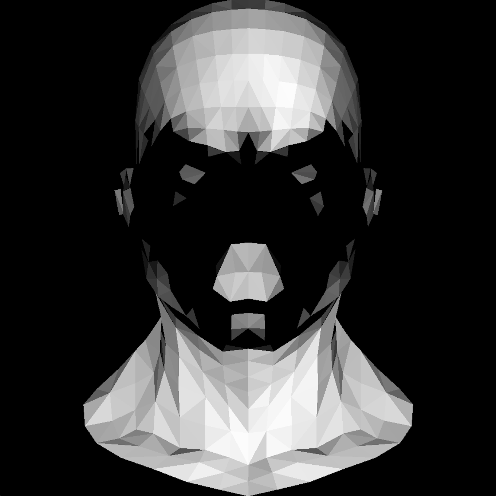
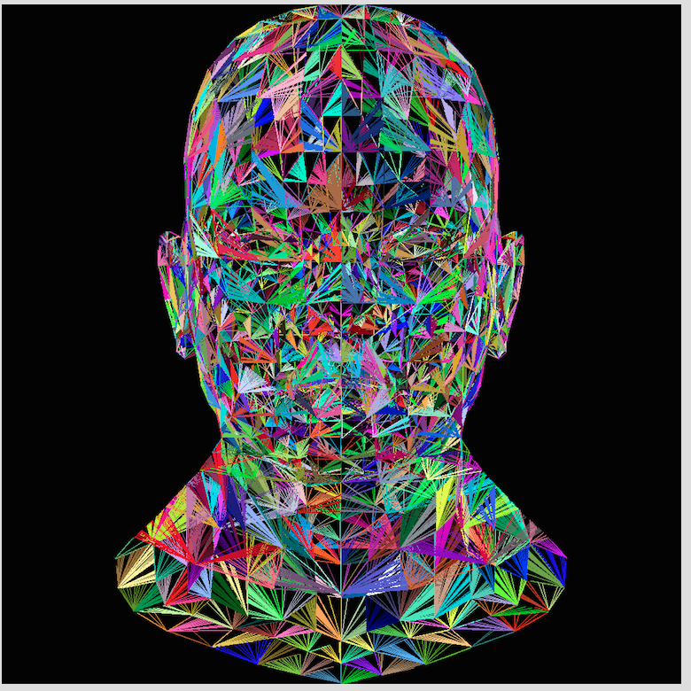
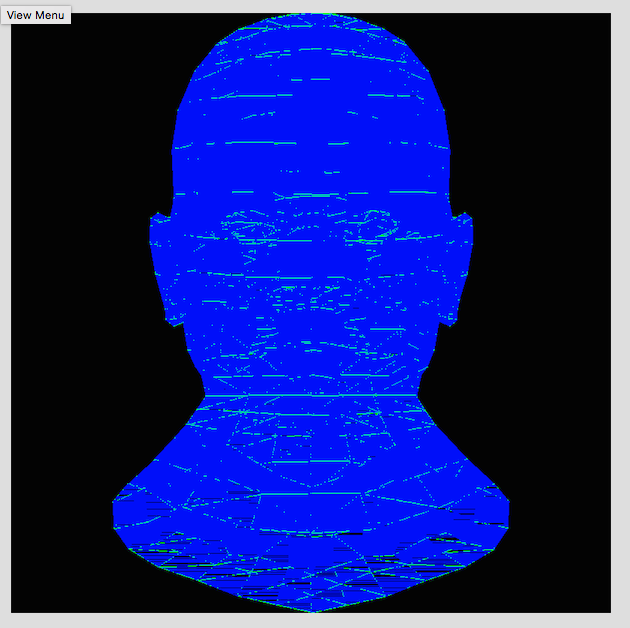
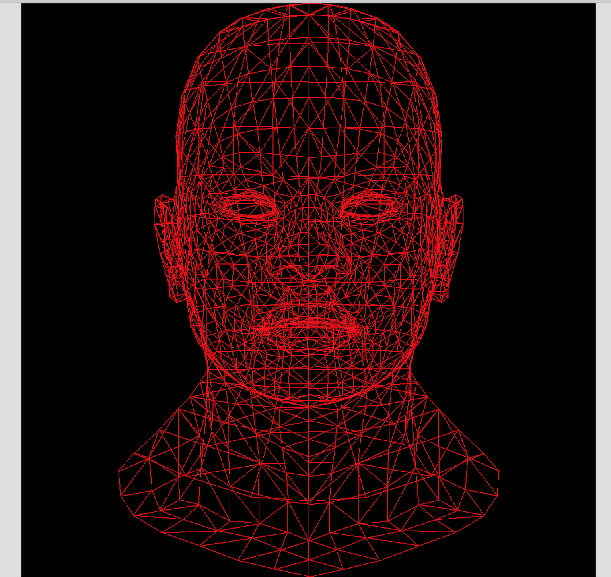

# renderer

here, adam tries to write a some code that will turn points into pictures to better understand graphics programming

i'm using https://github.com/ssloy/tinyrenderer to give me a nice order to implement features in.
the model is not my own.

here are some past progress screenshots; unfortunately I didn't capture any initial work, so the oldest screen is of a complete wireframe.

shading fixed

some naive gouroud fragment shading:

perspective projection:

now with a diffuse texture! it took a while for me to figure out how to map between uw and xyz. 

a functional light source! this uses z buffering instead of the normals i'm calculating to determine which faces should be drawn.

light almost working

eventually i got triangle filling correct. here's the first evidence of my lighting math being correct somewhere. this is also the first stab at backface culling; faces that aren't lit are colored 000.

here's a really cool error from an attempt at filling the triangles ... iirc, for each triangle, i was selecting a vertex and drawing lines from that vertex to the opposite edge by incrementing the angle between the "first" edge and the line to draw. didn't work, but it will make a great album cover one day.

i spent many weeks trying to fill in triangles, which it turns out is not easy. my math for moving between face coordinates and world coordinates was sloppy.

we can read a file with position vertices and draw a wireframe. 

